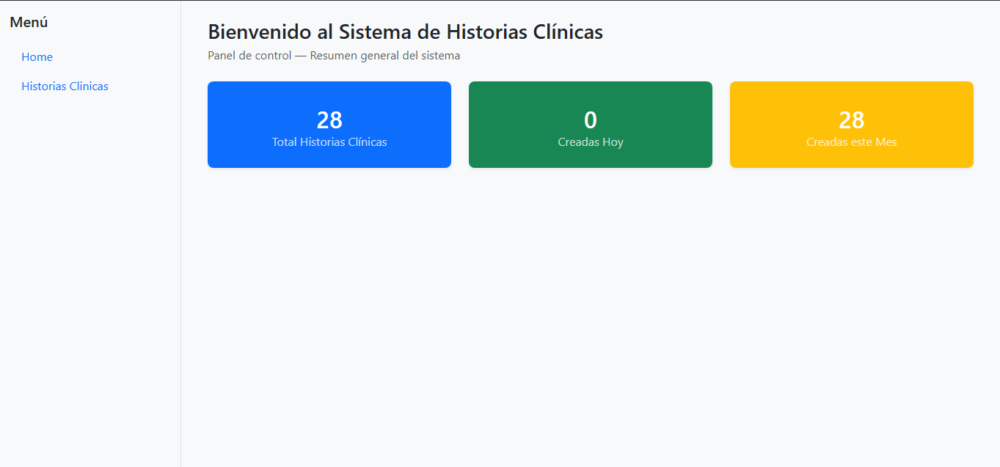
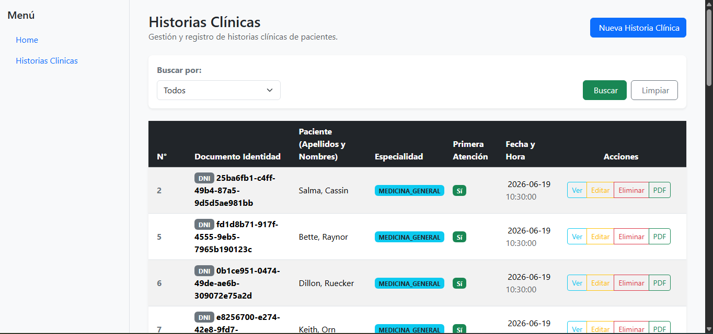

# HistoriasFront

Frontend del sistema de **Historias Clínicas Electrónicas**  
Desarrollado con **Angular 21** y **Bootstrap 5**.

## Capturas de Pantalla

| Home | Listado de Historias Clínicas |
|------|------------------------------|
|  |  |

## Funcionalidades

- **Home** — Panel con resumen: total de historias clínicas, creadas hoy y creadas en el mes.
- **Listar** — Tabla con todas las historias clínicas registradas, con búsqueda por número de documento, especialidad, nombres o apellidos.
- **Crear** — Formulario con pestañas para registrar una nueva historia clínica (Datos Generales, Signos Vitales, Consulta y Tratamiento).
- **Ver** — Vista detallada de una historia clínica.
- **Editar** — Modificación de una historia clínica existente.
- **Eliminar** — Borrado de registros.
- **Descargar PDF** — Genera y descarga un PDF con los datos completos de la historia clínica.

## Tecnologías

| Tecnología | Versión |
|-----------|---------|
| Angular | 21 |
| Bootstrap | 5.3 |
| TypeScript | 5.9 |
| Vitest | 4.0 |

## Requisitos

- Node.js >= 22
- Angular CLI (`npm install -g @angular/cli`)
- Backend corriendo en `http://localhost:8080`

## Instalación

```bash
npm install
```

## Desarrollo

```bash
ng serve
```

Navegar a `http://localhost:4200`. La aplicación se recarga automáticamente al modificar archivos.

## Build

```bash
ng build
```

Los artefactos se generan en `dist/`.

## Backend

El backend correspondiente está en el proyecto `historias-back` (Spring Boot + PostgreSQL), https://github.com/Jozehp0815/historias-back.git.
